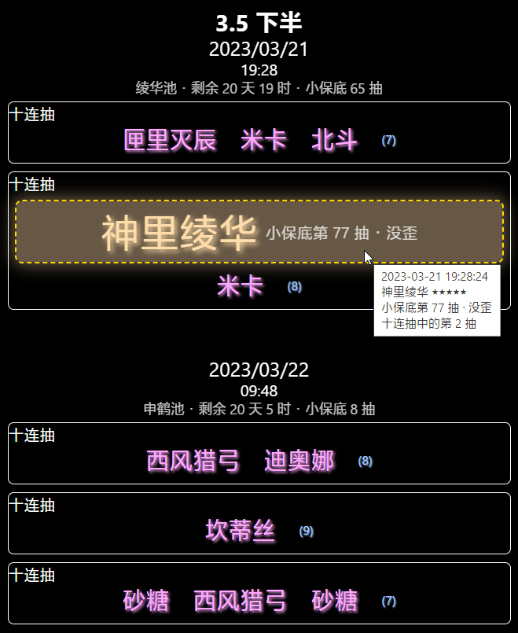

# 原神抽卡记录可视化 Genshin gacha history visualizer

这是一个简易的工具，可以将您的原神抽卡记录以直观而详细的格式呈现，不仅显示五星物品，也包括四星物品。您可以看到抽的是哪个卡池，卡池中有哪些UP四星（仅限活动祈愿），抽卡时卡池的剩余时间、保底抽数，以及哪些物品是在十连抽中抽到的、是十连抽中的第几抽。

This is a simple tool that shows your Genshin Impact gacha history in a clear and detailed format, including not only 5-star items but also 4-star items. You can see which banner you pulled from, which featured 4-star items are in that banner, the remaining time and pity counter when you pulled, as well as which items are from a 10-wish set, and how manyth wish each is on.

（三星物品目前会被省略，只显示三星物品的个数。）

(3-star items are currently omitted, only the count of 3-star items is showed.)

__[立即试用 · Try it now!](http://dgck81lnn.pony.icu/gi/gacha/)__

如果您发现本工具存在 bug，或有任何意见或建议，欢迎在 issues 中指出。

If you discover bugs or have any suggestions to improve this tool, feel free to submit an issue!

## 已知问题 Known issues

* 每次卡池更新后，本工具需要一小时到一天（具体暂不确定）的时间来更新卡池数据，届时如果您导入最新的抽卡记录，本工具可能会显示错误的数据。

  Every time new banners come out, it may take some time between an hour and a day for this tool to update its banner data, wherein erroneous data may be presented if you import your latest gacha history.

## 计划功能 Planned features

- [X] 导入/导出 [UIGF] 格式的抽卡记录文件

  Import & export gacha history as files in the [UIGF] format

- [X] 通过抓包 URL 自动获取记录

  Automatically fetch gacha history using URL from packet capture

- [X] 显示/隐藏常驻池、新手池记录

  Show/hide standard & beginner banner history

- [X] 支持 [UIGF] v2.3

  Support for [UIGF] v2.3

- [ ] 支持简体中文以外的语言

  Support for languages other than Simplified Chinese

- [ ] _《崩坏星穹铁道抽卡记录可视化》_

  A similar tool for Honkai: Star Rail

[UIGF]: https://uigf.org/zh/standards/UIGF.html
